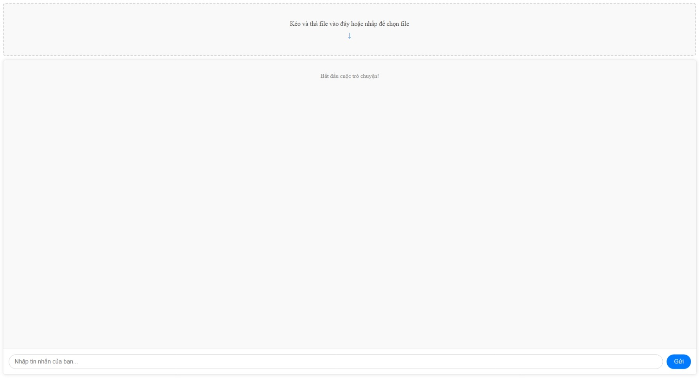

# SIMPL-RAG


# Key-features
- Multi-instance Support: The application is designed to run multiple instances independently and in parallel, enhancing scalability and fault tolerance.

- In-memory Document Processing: Document data is processed directly in RAM, significantly speeding up data handling for high-performance, low-latency tasks.

- RAG with Gemini (Retrieval-Augmented Generation): Integrates RAG using the Gemini AI model to retrieve relevant information from a data store and generate accurate, contextually rich responses.

- Auto-delete Inactive Users: Automatically removes user data after 30 minutes of inactivity to optimize resource management and enhance data security.

# Requirements
- Python: 3.11
- Node: 22.16

# Running the Application
Navigate to the project root: Open your terminal and go to the directory where docker-compose.yml is located.

Build the Docker images: This command will build the images for both frontend and backend services.

```bash
docker-compose build
```

Start the services: This command will create and run the containers.

```bash
docker-compose up
```

To run in detached mode (in the background):

```bash
docker-compose up -d
```

Once the services are up, you can access your:

Frontend application at http://localhost:3000

Backend API at http://localhost:8000